# Assignment #1 : Prepare Environment

### Basic Info:

* This assignment is **NOT graded**, and it does no harm to skip it.
* The deadline is 10/2 11:59 PM.
    * If the Syllabus and/or class notification made by instructor or TAs indicates a different DDL, please refer to the latest information.

### Step 1:  Begin with these steps to repository setup:

This section is previously used for the instruction for GitHub repo setting up. Since we're using the Bruin Learn platform now, you don't need to do the setup. Feel free to continue with the next step. 

Of course, you should unzip the assignment material to your local file system (please unzip if you're reading this line inside the compression file preview now, usually happens on Windows users with File Explorer) and you can optionally use git to control your version.

### Step 2:  Now follow these steps to run and modify your project:

> Before you start:
>
> * The following steps is using a traditional way to complete the assignment.
> * It will work, but we will recommend you to use an IDE (**very strongly recommend**).
>   * See the chapter at the end of this article.
> * We will discuss both way in the TA sections.

1. Go to your folder.  The easiest way is to right click the popup (in your browser) that downloaded it, then choose ``Show in Folder``. You should see following files listing in your opened folder.

   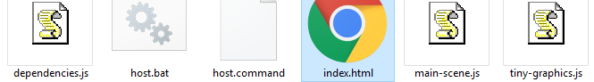
   
   > Please refer to this folder as  the`Root Folder` for this Assignment, which containing an `index.html`.

2. You should see the file index.html in your folder.  You can already try clicking that open to see the code run on your machine but in most cases, you can only see a blank page with title `Tiny Graphics`. That's because the webpage is unable to load local files (scripts, texture images, sounds, models) out of your own file-system, due to its safety protections against your web browser.

3. Run a fake server, which lacks those security protections.  Do this by opening the file we gave you called ``host`` -  ``host.bat`` if you're Windows, ``host.command`` if you're Mac. On Windows you can just double click the file open.

   * Python is required for the fake server.

   * **On Mac, you might get a security warning instead if you double-click.**  Instead, right click the files, then choose Open, or you can go into System Preferences/Security & Privacy/General and click 'Open Anyway'. You may possibly need to check the file permissions and set them to 744.

   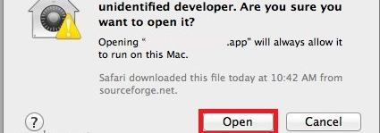

   * On newer MacOS versions, you may even need to go to system preferences to allow the script to run. So you can also consider open a terminal at this folder and run `python server.py`.
   
4. Look in the resulting console window.  If you can't find a message starting with ``Serving HTTP on ...``, your operating system might not have come with Python; go download and install that first -- use Google for help on that, then try our files again.

   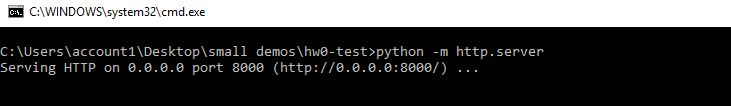

5. Now you're hosting. Keep that window open.

6. Open a new window of Google Chrome.  Download it first if needed.

   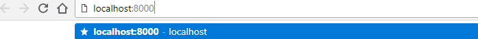

7. Navigate Chrome to the url http://localhost:8000/
That assumes that step 5's message said port 8000 - otherwise change the number in the URL to match.

8. Observe that your project shows up at this new URL.  That's where you'll access it from now on.

   

Unfortunately, web developers in practice have to do that fake server thing pretty often to be able to work on their files locally. **Keep the .bat or .command program open while you work.**


### Step 3:  Continue the next steps to begin viewing the code.  

1. Although any text editor will work on our files, for this class you'll need to use the editor inside of Chrome, because of its debugging tools.  

2. Resume with the open Chrome window from the previous step 8.

   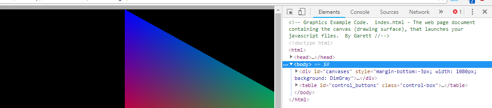

3. Press F12 (Windows) or Cmd+Option+i (Mac) to open the Chrome developer tools panel (DevTools).

4. You want DevTools to be able to take up the whole screen.  Undock it from your web page window.  Do this by clicking the ellipsis at the upper right corner, and selecting the first choice under ``Dock Side``.

   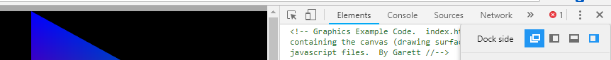

5. Maximize both your web page window and DevTools windows.  Use the keyboard shortcut Alt+tab (Windows) or three finger swipe (Mac) to switch between them quickly.

6. Click the ``Sources`` tab of the DevTools panel, towards the top of the screen.

   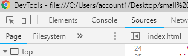

7. Without leaving the ``Sources`` outer tab, look at the navigator panel on the left.  This might be collapsed in the upper corner.  Regardless open the ``Page`` inner tab underneath it.

8. You should see all the files you downloaded from GitHub here.  Click them open to make sure you can see the code.  Now you can read it all here.

   

These steps and the following ones, may seem like a lot of work, but they are part of becoming a real web developer with a good workflow, as opposed to someone who just knows the language.  The biggest key of all to becoming a good developer is actually going be mastering the **debugger** feature, but first for this assignment let's just take it slow and set up our editor.


### Step 4:  Continue the next steps to begin modifying:

1. Change from the ``Page`` inner tab to the ``Filesystem`` inner tab, which might be collapsed behind the arrow.  This one should be empty.

   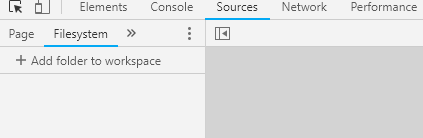

2. Drag and drop your local file folder from your computer's folder navigator straight into the middle of the DevTools window.  If you can't figure out how to drag between maximized windows (you can), just use the manual ``add folder to workspace`` button and choose your folder. Either way this will complete the mapping between your real local files and the fake ones over the network.
	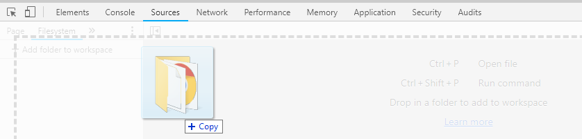
	
	* It's going to ask you for permission to modify your local files.  Hit yes.
	* If this doesn't happen as described, try to find help on setting your local folder as a workspace.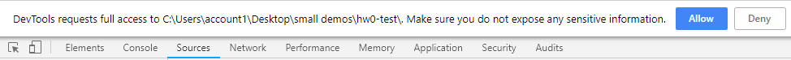

3. Observe the little green dots next to each file in the ``Filesystem`` subtab.  These green dots verify that your Chrome has matched your fake server to your local files.

4. Sometimes a green dot is missing -- especially on index.html.   That is dangerous; the file is not mapped right and any changes you make to it will be lost.  When green dots are missing, hit ctrl+F5 (Windows) or cmd+F5 (Mac) to do a hard refresh.  This re-loads them from your local files and re-maps them again.

   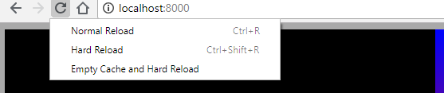

Be aware that for as long as you have DevTools open, back at browser window you have unlocked some new ways to refresh:  Right-click the refresh button to see them.

5. If the green dots still don't show up, delete what's in the workspace area and try again until they appear.

6. Now you can edit the files directly inside Chrome, in the DevTools ``Sources`` tab.
   * As long as you make changes under ``Sources`` and not ``Elements``, your changes will now persist in your own local files even after page refreshes.
   * You should avoid ever accidentally typing in the ``Elements`` tab.  That's only for temporary HTML stuff your code generates.

Editing directly in Chrome like this is the workflow we will use.  One reason is that your code immediately changes its behavior as you type.  Even when it's in the middle of running, or as soon as you un-pause it in the debugger.  Elements will move around on the page immediately when you make changes.  This allows you to you dynamically test new code without re-starting your whole animation and losing your place -- without having to wait for your timed scenes to progress to that point again -- or without having to enter the right inputs again.


### Step 5:  Continue the next steps to begin using Chrome as a code editor:

1. If you've never learned your way around an IDE for editing code, now is the time to.  Chrome's code editor is kind of in-between in terms of quality:  Better than Windows Notepad or TextEdit, but not quite as good as Notepad++ or Microsoft VSCode.  In order for it to be better than crudely opening your code in notepad, you need to know what basic features to expect from a text editor.  Let's learn them.

2. Find and try each of the following code editing commands once. They're found in that DevTools Sources tab.
   * Block indent / unindent (Tab and Shift+Tab)
   * Block comment / uncomment (Ctrl+/ or Cmd+/)
     ** For both of the above bullet points, try it on multiple highlighted lines at once.
   * Zoom in/out while reading
     ** Hold down Ctrl (Windows) or Cmd (Mac) and then press plus, minus, or zero to adjust.
     ** Use this fit a comfortable amount of code on-screen for you to read at once.
   * find (Ctrl+f or Cmd+f)
   * find-and-replace
   
     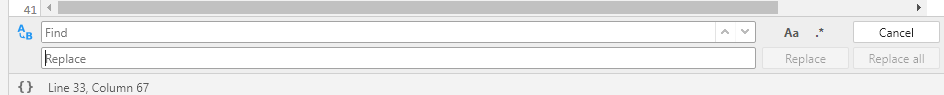
     
     ** For both of the above bullet points, note that you don't have to find specific or exact strings; Chrome supports matching **regular expressions**, for finding all text of a more general pattern.  That's the .* button.


### Step 6:  Continue the next steps to complete homework 1:

1. With our animation running in Chrome, with DevTools still open to the Sources tab.  Open the file ``assignment1.js``.  This is under the ``Filesystem`` tab of the navigator panel, which might be collapsed in the upper corner.

2. If there's no green dot next to  ``assignment1.js``, fix it as described above.

3. On line 16, add the following three items to the JavaScript array, which is all the text enclosed by square brackets [ ].  Add a comma to separate from previous items in the array.

   ```js
   vec3(1, 1, 0), vec3(1, 0, 0), vec3(0, 1, 0)
   ```
5. On line 19, add the following three items to the JavaScript array:
   
   ```js
   color(1, 1, 0, 1), color(0, 1, 0, 1), color(0, 0, 1, 1)
   ```
6. Save the file, and reload the page (using Ctrl+Shift+r for Windows, Cmd+Shift+r for Mac).  Switch back to look at your web page window.  The triangle should be a square now, because you just attached a second triangle to it.  If so, your edit worked and your file is saved.  If not, check for green dots and fix it as per above.

   

7. If you typed the wrong thing, you could get console errors, a blank web page, or missing triangles.  Later on we'll show you how to use the debugger and the console together to approach errors in a smart way.  For now, just type it right.

8. Your files should be ready to turn in now, including your trivial change.


### Step 7: Submission

Compress (zip) the whole assignment root folder into a ZIP format compressed file. Submit it to the Assignment in Bruin Learn where you download this. 

Please make sure you included everything in the assignment, rather than only the file(s) you made changes. The structure of the compressed file should be the same with the provided assignment material.

---

### Using IDE

Here we will discuss how to use IDE WebStorm to complete the above steps in a much easier way. As UCLA students, we can use it for free (and many other IDEs from JetBrain brand). Check their official homepage for how to get a free licence and install it: https://www.jetbrains.com/webstorm/

> Other IDEs are also fine, but we will take WebStorm as an example.
>
> VSCode is popular in recent days, and, though it is technically an editor rather than an IDE, it is powerful enough to help with the assignments as well, if you install the right extensions.

First, complete the Step 1 and have an unzipped assignment root folder that contains `index.html`.

Then, open the WebStorm and choose `Open` (or in the menu bar: File / Open...) to open an existing project folder. Choose our assignment root folder:

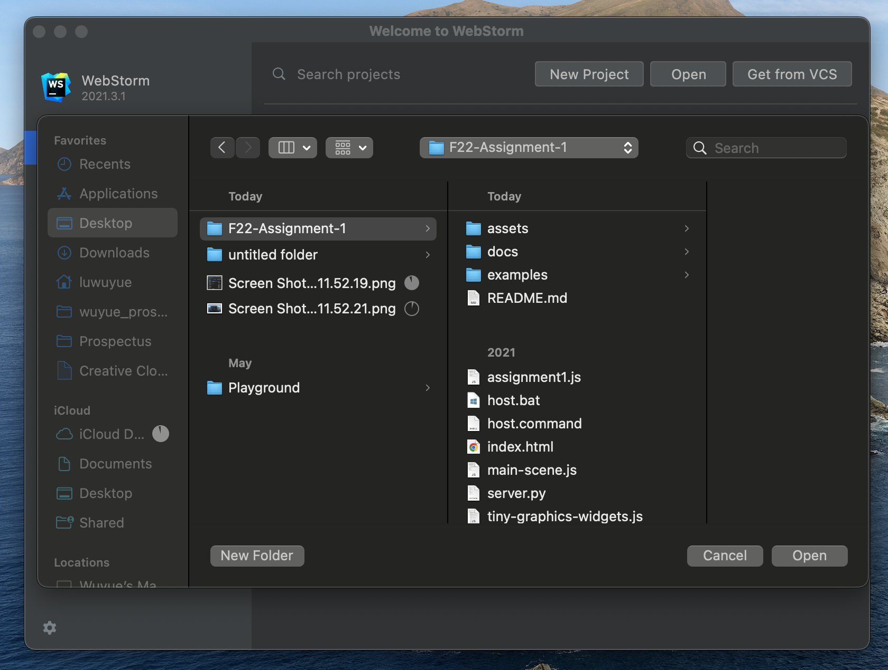

In the opened project view, we will first make correct running and debugging configurations, so the IDE can help us to run the server and reflect the changes on the go. You can edit the configurations and set every parameter as needed if you're an exert of these kind of things. Or an easy way is as follows:

* Open the `index.html` in your IDE by double clicking the file on the Project Panel (list of files in left part of IDE), make sure you see the code in `index.html` in IDE.

* Choose menu bar action: Run / Run... 
  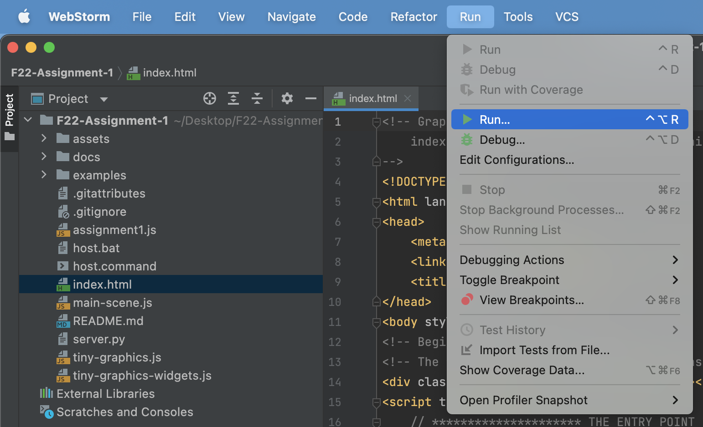

* A pop-up should show and click `index.html`.
  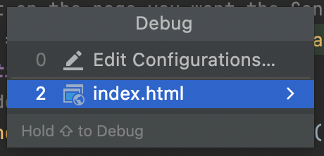

* You should see a webpage opened in your default browser with expected colorful triangle in the above Step 2

Then, we can do modifications to the scripts. Open `assignment1.js` in the IDE and make the required editing as described in Step 6, and save the file (never forget to save everything before you want to see the effect of modification). Now, you should see the desired colorful rectangle in the previous webpage if you refresh it.

As you can feel, using an IDE is much more convenient. You should feel it more when it comes to debugging, which is something painful but we must overcome for software developing. Using an IDE will reduce this pain and that's why we strongly recommend the class to use an IDE to complete the assignments as well as the team project.

There are so many resources from JetBrain and online discussions about how to master this IDE. Check this [site](https://www.jetbrains.com/webstorm/learn/) to learn more trick and tips about WebStorm.
